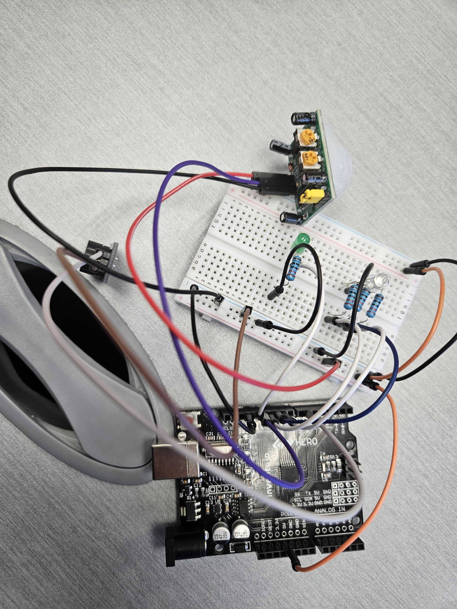
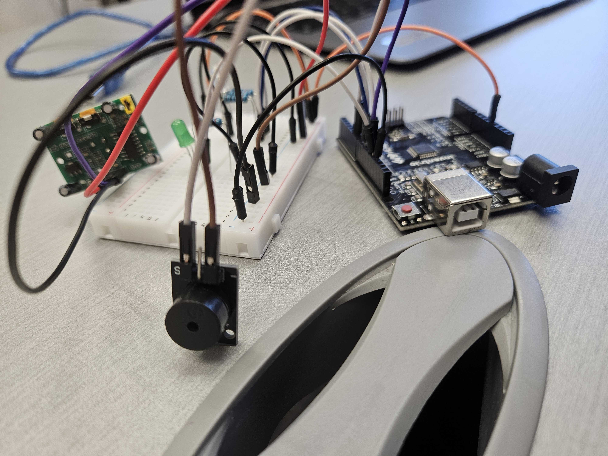

# Motion-Activated System

This project uses a **PIR motion sensor** to act like an alarm system. When building the physical project, you must **calibrate the motion sensor** yourself. The motion sensor doesn't come calibrated and is extremely sensitive, I have not figured out the calibration so the project's functionality can only be shown in the online simulation.

---

## Components Used

| Component               | Quantity |
|------------------------|----------|
| Arduino Uno R3         | 1        |
| Breadboard             | 1        |
| Green LED                | 1        |
| RGB LED                | 1         |
| 220Ω Resistors          | 4        |
| PIR Motion Sensor            | 1        |
| Jumper Wires           | 22      |
| Piezo Buzzer            | 1       |

---

## Installation & Setup

1. **Connect Power to the Bread Board**
   - 5V → Bread Board positive strip (+)
   - GND → Bread Board negative strip (-)
   
2. **Connect the LEDs**  
   - Green LED anode (+) → Digital Pin 13  
   - Green LED cathode (–) → 220Ω Resistor → GND
   - RGB LED (Red Pin) → 220Ω Resistor → Digital Pin 11 
   - RGB LED cathode (–) →  GND
   - RGB LED (Blue Pin) → 220Ω Resistor → Digital Pin 9 
   - RGB LED (Green Pin) → 220Ω Resistor → Digital Pin 10 

3. **Connect the Piezo Buzzer**  
   - Positive → Digital Pin 6  
   - Negative → GND

4. **Connect the PIR Sensor**  
   - OUT → Digital Pin 12  
   - VCC → 5V  
   - GND → GND

6. **Upload the Code**:
   - Open [Arduino IDE](https://www.arduino.cc/en/software/).
   - *Install the program if you don't already have it.*
   - Connect your Arduino Uno via USB.
   - Upload your `.ino` sketch.

---

## How It Works

***As stated previously, the motion sensor only is working in the sImulation due to how sensitive the physical sensor is.  You may need to modify the code and calibrate the sensor for it to work.***

- The system starts in **standby mode** with the **green LED** turned on.
- When the **PIR sensor detects motion**:
  - The green LED turns off.
  - The **RGB LED flashes** in red and blue.
  - The **buzzer** sounds an alert.
- After a few seconds, the system resets back to standby if no further motion is detected.

---

## Images / Video

- 
- 

---

## Simulation

> Use an online simulator like [Tinkercad](https://www.tinkercad.com/) to view the project simulation.

- [Tinkercad Simulation Link](https://www.tinkercad.com/things/7FyyHmR1GI8-motion-activated-system?sharecode=vtPk8MF6ozgHBPnROnb4BKiVWxenJ1yGdN379Zka5EY)

---

## Credits

- Project by: *Nat King*  
- Inspired by: Motion detection lights and alarm systems

---
